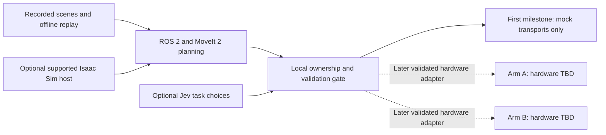

# Architecture and compute choice

Research checked 2026-09-30. These are design decisions and primary-source requirements, not measured dual-arm performance.

## Separate development from deployment

The host chooses bounded joint trajectories and supervises execution; each ESP32 retains its servo control. One coordinator owns both arms and the shared collision scene. Use unique joint, link and controller prefixes (neutral development placeholders `arm_a_`/`arm_b_`), a single `cell_world`, measured fixed base transforms, and a shared clock policy. Physical arm selection, final names and placement are TBD; placeholders do not map to any existing teleoperation label. Define per-arm, gripper and combined planning groups. Independent single-arm plans do not establish inter-arm collision avoidance.

Prefer two independent USB serial links for initial deployment, with explicit persistent identity mapping and one writer per arm. Preserve existing ESP-NOW demonstration configurations; a later, reviewed transition must exclude leader/radio/web/mission writers before autonomous ownership. No automatic switch on startup. Lease/epoch, monotonic sequence, deadline, calibration/scene revision and per-arm acknowledgment belong in the local coordinator; vendor serial JSON must not be assumed to implement these contracts.

Start with alternating movements in non-overlapping zones. Synchronized bimanual trajectories require measured clock/skew, feedback timing, queue behavior and a failure policy for either arm. On stale feedback, loss of one transport, ownership conflict, or invalid calibration, reject new trajectories and enter a locally latched fault state; the actual physical stop mechanism is a separate unvalidated requirement in [HARDWARE.md](HARDWARE.md).

## Host matrix

| Role | Recommendation and evidence |
| --- | --- |
| Mac | Edit, asset checks, recorded-data processing and remote workstation client. It is not an officially supported Isaac Sim execution host. |
| Isaac Sim host | Current NVIDIA requirements: x86_64 Ubuntu 22.04/24.04 or Windows 11, minimum RTX 4080, 16 GB VRAM, 32 GB RAM and 50 GB SSD. Containers require Linux. Arm builds are supported only on DGX Spark (DGX OS 7); neither Jetson target is listed. Pin a release and run NVIDIA's compatibility checker before installation. [Official requirements](https://docs.isaacsim.omniverse.nvidia.com/latest/installation/requirements.html). |
| Jetson Orin Nano | Candidate for two serial links, bounded planning and modest perception. The Super developer kit lists 8 GB shared memory, 67 INT8 TOPS and 7–25 W. This does not prove a particular camera/model/planner fits or meets timing. Confirm actual module/RAM and profile the workload. [Official specifications](https://www.nvidia.com/en-us/autonomous-machines/embedded-systems/jetson-orin/nano-super-developer-kit/). |
| Jetson Thor | Candidate when larger perception/policy models and concurrent cameras justify the memory/compute. Do not infer deterministic control or Isaac Sim support from the GPU. Confirm the exact kit and installed stack. [Official product reference](https://www.nvidia.com/en-us/autonomous-machines/embedded-systems/jetson-thor/). |

PR20's [prior Thor inventory](https://github.com/jhacksman/RoArm-M3/blob/1553d15a76c0829a8fdd417f326442fbc65102d2/experiments/jev/research/THOR_INVENTORY.md) recorded AGX Thor, Ubuntu 24.04.3, L4T 38.4, 122 GiB RAM, 38 GiB free storage, and no ROS match in its package query. It did not establish a JetPack version or exhaustively inspect containers. Reuse this evidence; do not silently assume a clean or current installation. No device was contacted for this wing.

## Software choices and version gate

Isaac **ROS** provides accelerated ROS packages on the robot; Isaac **Sim** simulates on its supported host. Neither is mandatory merely to command two arms. Current [Isaac ROS requirements](https://nvidia-isaac-ros.github.io/getting_started/index.html) list Jetson Thor/Orin with JetPack 7.2 and ROS 2 Lyrical, plus 128+ GB NVMe. These are current supported combinations, not evidence that the existing Thor or every Nano configuration matches. The official RoArm workspace inspected here is the `ros2-humble` branch. That mismatch must be resolved before selecting images or installing dependencies; pin OS, ROS, JetPack, CUDA, Python, MoveIt, bridge and simulator versions as a tested set.

For the first geometric milestone, use a ROS/MoveIt 2 environment compatible with the selected host and port the description deliberately. [MoveIt multiple-arm guidance](https://moveit.picknik.ai/main/doc/examples/dual_arms/dual_arms_tutorial.html) supplies naming/planning concepts. RViz is visualization, not contact physics. A supported Gazebo/ROS combination is another option for actuator/contact tests; the vendor model's legacy Gazebo plugin needs migration, not blind launch. Isaac Sim earns its cost when photorealistic cameras, sensor simulation or synthetic training data answer a concrete experiment. No simulator substitutes for measured backlash, payload, compliance or stop behavior.
